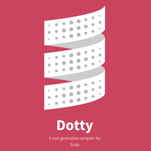

# Building Scala 3 on Windows [↩](README.md#top)

<table style="font-family:Helvetica,Arial;line-height:1.6;">
  <tr>
  <td style="border:0;padding:0 10px 0 0;min-width:60px;max-width:100px;">
    
  </td>
  <td style="border:0;padding:0;vertical-align:text-top;">
    Source code of the <a href="https://dotty.epfl.ch/" rel="external">Dotty project</a> is hosted on <a href="https://github.com/lampepfl/dotty/" rel="external">Github</a> and continuous delivery is performed on the <a href="https://dotty-ci.epfl.ch/lampepfl/dotty" rel="external">Dotty CI</a> server <a href="#footnote_01">1</a> from <a href="https://lamp.epfl.ch/" rel="external">LAMP/EPFL</a>. This document describes changes we made to the <a href="https://github.com/lampepfl/dotty/" rel="external">lampepfl/dotty</a> repository in order to successfully execute the CI build/test steps on a Windows runner (GitHub-hosted) <b><i>and</i></b> to reproduce the same build/test steps on a <i>local</i> Windows machine. &nbsp;
  </td>
  </tr>
</table>

This document is part of a series of topics related to [Scala 3][scala3_home] on Microsoft Windows:

- [Running Scala 3 on Windows](README.md)
- Building Scala 3 on Windows [**&#9660;**](#bottom)
- [Data Sharing and Scala 3 on Windows](CDS.md)
- [OpenJDK and Scala 3 on Windows](OPENJDK.md)

[Ada][ada_examples], [Akka][akka_examples], [C++][cpp_examples], [Dart][dart_examples], [Deno][deno_examples], [Flix][flix_examples], [Golang][golang_examples], [GraalSqueak][graalsqueak_examples], [GraalVM][graalvm_examples], [Kotlin][kotlin_examples], [LLVM][llvm_examples], [Node.js][nodes_examples], [Rust][rust_examples], [Spark][spark_examples], [Spring][spring_examples], [TruffleSqueak][trufflesqueak_examples] and, [Wix Toolset][wix_examples] and [Zig][zig_examples] are other topics we are continuously investigating.

## Project dependencies

Our [Dotty fork][github_dotty_fork] depends on the following external software for the **Microsoft Windows** platform:

- [Git 2.46][git_releases] ([*release notes*][git_relnotes])
- [sbt 1.10][sbt_releases] (requires Java 8) ([*release notes*][sbt_relnotes])
- [Temurin OpenJDK 11][openjdk_releases] [2](#footnote_02) ([*release notes*][openjdk_relnotes])
<!--
8u212   -> https://mail.openjdk.java.net/pipermail/jdk8u-dev/2019-April/009115.html
8u222   -> https://mail.openjdk.java.net/pipermail/jdk8u-dev/2019-July/009840.html
8u232   -> https://mail.openjdk.java.net/pipermail/jdk8u-dev/2019-October/010452.html
8u242   -> https://mail.openjdk.java.net/pipermail/jdk8u-dev/2020-January/010979.html
8u252   -> https://mail.openjdk.java.net/pipermail/jdk8u-dev/2020-April/011559.html
8u322   -> https://mail.openjdk.java.net/pipermail/jdk8u-dev/2022-January/014522.html
11.0.7  -> https://mail.openjdk.java.net/pipermail/jdk-updates-dev/2020-April/003019.html
11.0.8  -> https://mail.openjdk.java.net/pipermail/jdk-updates-dev/2020-July/003498.html
11.0.9  -> https://mail.openjdk.java.net/pipermail/jdk-updates-dev/2020-October/004007.html
11.0.10 -> https://mail.openjdk.java.net/pipermail/jdk-updates-dev/2021-January/004689.html
11.0.11 -> https://mail.openjdk.java.net/pipermail/jdk-updates-dev/2021-April/005860.html
11.0.12 -> https://mail.openjdk.java.net/pipermail/jdk-updates-dev/2021-July/006954.html
11.0.13 -> https://mail.openjdk.java.net/pipermail/jdk-updates-dev/2021-October/009368.html
11.0.15 -> https://mail.openjdk.org/pipermail/jdk-updates-dev/2022-April/014104.html
11.0.16 -> https://mail.openjdk.org/pipermail/jdk-updates-dev/2022-July/016017.html
-->
Optionally one may also install the following software:

- [Temurin OpenJDK 17][temurin_openjdk17] ([*release notes*][temurin_openjdk17_relnotes])

> **&#9755;** ***Installation policy*** 
> When possible we install software from a [Zip archive][zip_archive] rather than via a Windows installer. In our case we defined **`C:\opt\`** as the installation directory for optional software tools (*in reference to* the [**`/opt/`**][unix_opt] directory on Unix).

For instance our development environment looks as follows (*January 2025*):

<pre style="font-size:80%;">
C:\opt\Git\                        <i>(388 MB)</i>
C:\opt\jdk-temurin-1.8.0u412-b08\  <i>(189 MB)</i>
C:\opt\jdk-temurin-11.0.24_8\      <i>(303 MB)</i>
C:\opt\jdk-temurin-17.0.12_7\      <i>(301 MB)</i>
C:\opt\sbt\                        <i>(137 MB)</i>
</pre>

> **:mag_right:** [Git for Windows][git_win] provides a BASH emulation used to run [**`git`**][git_cli] from the command line (as well as over 250 Unix commands like [**`awk`**][man1_awk], [**`diff`**][man1_diff], [**`file`**][man1_file], [**`grep`**][man1_grep], [**`more`**][man1_more], [**`mv`**][man1_mv], [**`rmdir`**][man1_rmdir], [**`sed`**][man1_sed] and [**`wc`**][man1_wc]).

## Directory structure [**&#x25B4;**](#top)

The directory structure of the [Dotty repository][github_dotty] [3](#footnote_03) is quite complex but fortunately we only have to deal with three subdirectories. Concretely our additions affect two groups of directories :

1. In directories [**`dotty\bin\`**](https://github.com/michelou/dotty/tree/master/bin) and [**`dotty\project\scripts\`**](https://github.com/michelou/dotty/tree/master/project/scripts) we add the batch files to support our build process on a Windows machine.

   <pre style="font-size:80%;">
   <a href="https://github.com/michelou/dotty-examples/blob/master/bin/dotty/bin/common.bat">dotty\bin\common.bat</a>
   <a href="https://github.com/michelou/dotty-examples/blob/master/bin/dotty/bin/scala.bat">dotty\bin\scala.bat</a>
   <a href="https://github.com/michelou/dotty-examples/blob/master/bin/dotty/bin/scalac.bat">dotty\bin\scalac.bat</a>
   <a href="https://github.com/michelou/dotty-examples/blob/master/bin/dotty/bin/scaladoc.bat">dotty\bin\scaladoc.bat</a>
   <a href="https://github.com/michelou/dotty-examples/blob/master/bin/dotty/project/scripts/bootstrapCmdTests.bat">dotty\project\scripts\bootstrapCmdTests.bat</a>
   <a href="https://github.com/michelou/dotty-examples/blob/master/bin/dotty/project/scripts/cmdTests.bat">dotty\project\scripts\cmdTests.bat</a>
   <a href="https://github.com/michelou/dotty-examples/blob/master/bin/dotty/project/scripts/cmdTestsCommon.inc.bat">dotty\project\scripts\cmdTestsCommon.inc.bat.bat</a>
   <a href="https://github.com/michelou/dotty-examples/blob/master/bin/dotty/project/scripts/genDocs.bat">dotty\project\scripts\genDocs.bat</a>
   </pre>

2. In directory [**`dotty\dist\bin\`**](https://github.com/michelou/dotty/tree/master/dist/bin) we add the batch files to be included in the generated software distributions.

   <pre style="font-size:80%;">
   <a href="https://github.com/michelou/dotty-examples/blob/master/bin/3.0/common.bat">dotty\dist\bin\common.bat</a>
   <a href="https://github.com/michelou/dotty-examples/blob/master/bin/3.0/scala.bat">dotty\dist\bin\scala.bat</a>
   <a href="https://github.com/michelou/dotty-examples/blob/master/bin/3.0/scalac.bat">dotty\dist\bin\scalac.bat</a>
   <a href="https://github.com/michelou/dotty-examples/blob/master/bin/3.0/scaladoc.bat">dotty\dist\bin\scaladoc.bat</a>
   </pre>
   > **:mag_right:** With [PR#13006](https://github.com/lampepfl/dotty/pull/13006) those batch files have been added to the 3.0.2 branch of Scala 3.

In the next section we give a brief description of the batch files present in those directories.

## Batch/Bash commands [**&#x25B4;**](#top)

We distinguish several sets of batch commands:

1. Directory [**`bin\3.0\`**](bin/3.0) - This directory contains the shell scripts and batch files to be added unchanged to a [Scala 3 software distribution][dotty_releases].
   > **:mag_right:** With the merge of [PR#13006](https://github.com/lampepfl/dotty/pull/13006) into the <a href="https://github.com/lampepfl/dotty/tree/release-3.0.2"><b><code>3.0.2</code></b> branch</a> of the [Dotty project][scala3_home] the copy operation below is no more required.

   <pre style="font-size:80%;">
   <b>&gt; <a href="https://man7.org/linux/man-pages/man1/cp.1.html">cp</a> bin\3.0\*.bat dotty\dist\bin</b>
   <b>&gt; <a href="https://docs.microsoft.com/en-us/windows-server/administration/windows-commands/dir">dir</a> /b dotty\dist\bin</b>
   common
   common.bat
   scala
   scala.bat
   scalac
   scalac.bat
   scaladoc
   scaladoc.bat
   </pre>

2. [**`build.bat`**](bin/dotty/build.bat)/[**`build.sh`**](bin/dotty/build.sh) - Both commands perform on a Windows machine the same build/test steps as specified in file [**`ci.yaml`**](https://github.com/michelou/dotty/blob/master/.github/workflows/ci.yaml) and executed on the [Dotty CI][dotty_ci] server.

   > **:mag_right:** Scala users working in a Linux-like environment such as Cygwin or MSYS2 can perform the same tasks with the bash script [**`./build.sh`**](bin/dotty/build.sh).

   <pre style="font-size:80%;">
   <b>&gt; <a href="https://man7.org/linux/man-pages/man1/cp.1.html">cp</a> bin\dotty\build.* dotty</b>
   <b>&gt; <a href="https://man7.org/linux/man-pages/man1/cp.1.html">cp</a> bin\dotty\project\scripts\*.bat dotty\project\scripts\</b>
   <b>&gt; <a href="https://docs.microsoft.com/en-us/windows-server/administration/windows-commands/cd">cd</a> dotty</b></pre>

   Command [**`build.bat help`**](bin/dotty/build.bat) display the help message.

   <pre style="font-size:80%;">
   <b>&gt; <a href="https://docs.microsoft.com/en-us/windows-server/administration/windows-commands/cd">cd</a></b>
   W:\dotty
   &nbsp;
   <b>&gt; <a href="bin/dotty/build.bat">build</a> help</b>
   Usage: build { &lt;option&gt; | &lt;subcommand&gt; }
   &nbsp;
     Options:
       -timer                 print the total build time
       -verbose               print progress messages
   &nbsp;
     Subcommands:
       arch[ives]             generate gz/zip archives (after bootstrap)
       boot[strap]            generate+test bootstrapped compiler (after compile)
       clean                  clean project
       clone                  update submodules
       compile                generate+test 1st stage compiler (after clone)
       community              test community-build
       doc[umentation]        generate documentation (after bootstrap)
       help                   print this help message
       sbt                    test sbt-dotty (after bootstrap)
       update                 fetch/merge upstream repository
   &nbsp;
     Advanced subcommands (no deps):
       arch[ives]-only        generate ONLY gz/zip archives
       boot[strap]-only       generate+test ONLY bootstrapped compiler
       compile-only           generate+test ONLY 1st stage compiler
       doc[umentation]-only   generate ONLY documentation
       sbt-only               test ONLY sbt-dotty
   </pre>

   Subcommands obey the following dependency rules for their execution:

    | **A** depends on **B** | Execution time**a)** | Output from **A** |
    | :------------ | :------------: | :------------ |
    | `clean` &rarr; &empty; | &lt;1 min | &nbsp; |
    | `clone` &rarr; &empty; | &lt;1 min | &nbsp; |
    | `compile` &rarr; `clone` | ~24 min | `compiler\target\` `library\target` `sbt-bridge\target\` |
    | `bootstrap` &rarr; `compile` | ~45 min | &nbsp; |
    | `community` &rarr; &empty; | &nbsp; | &nbsp; |
    | `archives` &rarr; `bootstrap` | &nbsp; | `dist-bootstrapped\target\*.gz,*.zip` |
    | `documentation` &rarr; `bootstrap` | &nbsp; | `docs\_site\*.html` `docs\docs\*.md` |
    | `sbt` &rarr; `bootstrap` | &nbsp; | &nbsp; |
    
    **a)** Average execution time measured on a i7-i8550U laptop with 16 GB of memory.

    > **:mag_right:** Subcommands whose name ends with **`-only`** help us to execute one single step without running again the precedent ones. They are listed as *Advanced subcommands* by command **`build help`** and should ***never*** be used in an automatic build.
    > 
    > | Subcommand       | Execution time | Output      |
    > |:-----------------|:--------------:|:------------|
    > | `compile-only`   | ~ 24 min | &nbsp; |
    > | `bootstrap-only` | ~ 26 min | &nbsp; |
    > | `archives-only`  | &lt; 1 min | `dist-bootstrapped\target\*.gz,*.zip` |
    > | `documentation-only` | &lt; 3 min | `docs\_site\*.html` `docs\docs\*.md` |
    > | `sbt-only`       | &nbsp; | &nbsp; |
    >
    > In particular we have the following equivalences:
    > 
    > | Command | Equivalent command |
    > | :------ | :----------------- |
    > | `build compile` | `build clone compile-only` |
    > | `build bootstrap` | `build compile bootstrap-only` |
    > | `build archives` | `build bootstrap archives-only` |
    > | `build documentation` | `build bootstrap documentation-only` |
    > | `build sbt` | `build bootstrap sbt-only` |

3. Directory [**`bin\dotty\bin\`**](bin/dotty/bin) - This directory contains batch files used internally during the build process (see the [**`bootstrapCmdTests.bat`**](bin/dotty/project/scripts/bootstrapCmdTests.bat) command).
   <pre style="font-size:80%;">
   <b>&gt; <a href="https://docs.microsoft.com/en-us/windows-server/administration/windows-commands/cd">cp</a> bin\dotty\bin\*.bat dotty\bin</b>
   <b>&gt; <a href="https://docs.microsoft.com/en-us/windows-server/administration/windows-commands/dir">dir</a> /b dotty\bin</b>
   common
   common.bat
   scala
   scala.bat
   scalac
   scalac.bat
   scaladoc
   scaladoc.bat
   </pre>

4. [**`bin\dotty\project\scripts\`**](bin/dotty/project/scripts/) - This directory contains bash files to performs test steps on a Windows machine in a similar manner to the shell scripts on the [Dotty CI][dotty_ci] server (see console output in section [**Usage examples**](#usage_examples)).

   | Batch file (**`build.bat`**) | Bash script (**`./build.sh`**) |
   | :--------- | :---------- |
   | [**`cmdTests.bat`**](bin/dotty/project/scripts/cmdTests.bat) | [**`cmdTests`**](https://github.com/michelou/dotty/blob/master/project/scripts/cmdTests) |
   | [**`bootstrapCmdTests.bat`**](bin/dotty/project/scripts/bootstrapCmdTests.bat) | [**`bootstrapCmdTests`**](https://github.com/michelou/dotty/blob/master/project/scripts/bootstrapCmdTests) |
   | [**`genDocs.bat`**](bin/dotty/project/scripts/genDocs.bat) | [**`genDocs`**](https://github.com/michelou/dotty/blob/master/project/scripts/genDocs)|

> **:mag_right:** From me reported issues and pull requests are listed in document <a href="./CONTRIBUTIONS.md"><code>CONTRIBUTIONS.md</code></a>.

## Usage examples [**&#x25B4;**](#top)

Command [**`build.bat`**](bin/dotty/build.bat) consists of ~400 lines of batch/[Powershell ][microsoft_powershell] code and features the following subcommands:

### **`build.bat clean`**

Command **`build.bat clean`** removes all generated *and untracked* files/directories from our [**Dotty fork**][github_dotty_fork]. Internally, **`build clean`** executes the command **`sbt clean`** (one may use [**`git clean -xdf`**][git_clean] to remove all untracked directories/files, including build products).

<pre style="font-size:80%;">
<b>&gt; <a href="bin/dotty/build.bat">build</a> clean</b>
[...(sbt)...]
Removing .vscode/
Removing HelloWorld$.class
Removing HelloWorld.class
Removing HelloWorld.tasty
Removing compiler/target/
Removing dist-bootstrapped/
Removing doc-tool/target/
Removing dotty-bootstrapped/
Removing interfaces/target/
Removing library/target/
Removing out/
Removing project/project/project/
Removing project/project/target/
Removing project/target/
Removing sbt-bridge/target/
Removing scala-compiler/
Removing scala-library/
Removing scala-reflect/
Removing scalap/
Removing setenv.bat
Removing target/
Removing testlogs/
</pre>

Command **`build -verbose clean`** also displays the tool paths/options and the current Git branch:

<pre style="font-size:80%;">
<b>&gt; <a href="bin/dotty/build.bat">build</a> -verbose clean</b>
Tool paths
   "GIT_CMD=C:\opt\Git\bin\git.exe"
   "JAVA_CMD=C:\opt\jdk-openjdk-11.0.23_9\bin\java.exe"
   "SBT_CMD=C:\opt\sbt\bin\sbt.bat"
Tool options
   JAVA_OPTS=-Xmx2048m -XX:ReservedCodeCacheSize=2048m -XX:MaxMetaspaceSize=1024m
   SBT_OPTS=-Ddotty.drone.mem=4096m -Dsbt.ivy.home=U:\.ivy2\ -Dsbt.log.noformat=true
Current Git branch
   master
&nbsp;
[...(sbt)...]
</pre>

### **`build.bat compile`**

Command **`build.bat compile`** generates the *"1st stage compiler"* for [Scala 3][scala3_home] and executes the relevant test suites. 

<pre style="font-size:80%;">
<b>&gt; <a href="bin/dotty/build.bat">build</a> compile</b>
sbt compile and sbt test
[...]
[info] Done compiling.
[...]
[info] Done packaging.
[...]
[info] Test run started
[info] Test dotty.tools.dottydoc.TestWhitelistedCollections.arrayAndImmutableHasDocumentation started
[info] Test run finished: 0 failed, 0 ignored, 1 total, 21.918s
[info] Test run started
[...]
8 suites passed, 0 failed, 8 total
[...]
[info] Test run started
[...]
2 suites passed, 0 failed, 2 total
[...]
[info] Test run started
[...]
11 suites passed, 0 failed, 11 total
[...]
[info] Test run started
[...]
[info] Passed: Total 73, Failed 0, Errors 0, Passed 73
[info] Passed: Total 290, Failed 0, Errors 0, Passed 288, Skipped 2
[success] Total time: 1063 s, completed 16 nov. 2018 15:39:19
testing sbt scalac and scala
hello world
testing sbt scalac -from-tasty and scala -classpath
hello world
testing sbt scalac -decompile
[...]
testing sbt scala with no -classpath
hello world
testing loading tasty from .tasty file in jar
[...]
</pre>

### **`build.bat bootstrap`**

Command **`build.bat bootstrap`** works as follows: ***if*** execution of the **`compile`** subcommand was successful the **`bootstrap`** subcommand generates the *"bootstrap compiler"* for [Scala 3][scala3_home] and executes the relevant test suites.

<pre style="font-size:80%;">
<b>&gt; build bootstrap</b>
[...]
</pre>

### **`build.bat community`**

Command **`build.bat community`**  generates subprojects from **`community-build\community-projects\`**: 

<pre style="font-size:80%;">
<b>&gt; build community</b>
[...]
</pre>

### **`build.bat archives`**

Command **`build.bat archives`** works as follows:  ***if*** execution of the **`bootstrap`** subcommand was successful the **`archives`** subcommand generates the gz/zip archives. Below we execute the **`arch-only`** subcommand for the sake of brievity (previous steps are *assumed* to be successful): 

<pre style="font-size:80%;">
<b>&gt; <a href="bin/dotty/build.bat">build</a> arch-only</b>
[...]
&nbsp;
<b>&gt; <a href="https://docs.microsoft.com/en-us/windows-server/administration/windows-commands/dir">dir</a> /a-d /b dist\target</b>
scala3-3.4.0-RC1-bin-SNAPSHOT.tar.gz
scala3-3.4.0-RC1-bin-SNAPSHOT.zip
</pre>

### **`build.bat documentation`**

Command **`build.bat documentation`** works as follows: ***if*** execution of the **`bootstrap`** subcommand was successful the **`documentation`** subcommand generates the [Scala 3][scala3_home] website and the online [Scala 3 documentation][scala3_docs]. Below we execute the **`doc-only`** subcommand for the sake of brievity (previous operations are *assumed* to be successful): 

<pre style="font-size:80%;">
<b>&gt; <a href="bin/dotty/build.bat">build</a> -timer doc-only</b>
Working directory: W:\dotty
[...]
[info] Running (fork) dotty.tools.dottydoc.Main -siteroot docs -project Dotty -project-version 3.3.1-bin-SNAPSHOT -project-url https://github.com/lampepfl/dotty ...
Compiling (1/406): AlternateConstructorsPhase.scala
[...]
Compiling (406/406): package.scala
[...]
28 warnings found
there were 3987 feature warning(s); re-run with -feature for details
[doc info] Generating doc page for: dotty.tools.dotc.plugins
[...]
[doc info] Generating doc page for: dotty.tools.dotc.core.unpickleScala2.Scala2Unpickler$.TempPolyType$
&equals;================================================================================
Dottydoc summary report for project `Dotty`
&equals;================================================================================
Documented members in public API:
[...]
Summary:
&nbsp;
public members with docstrings:    5181/14606 (35%)
protected members with docstrings: 164/537 (30%)
&equals;================================================================================
&nbsp;
Documented members in internal API:
[...]
Summary internal API:
&nbsp;
public members with docstrings:    154/601 (25%)
protected members with docstrings: 6/60 (10%)
private members with docstrings:   464/2450 (18%)
total warnings with regards to compilation and documentation: 29
[success] Total time: 146 s, completed 29 nov. 2018 11:49:22
Total execution time: 00:02:36
</pre>

Output directory **`docs\_site\`** contains the files of the online [Scala 3 documentation][scala3_docs]:

<pre style="font-size:80%;">
<b>&gt; <a href="https://docs.microsoft.com/en-us/windows-server/administration/windows-commands/dir">dir</a> /b docs\_site</b>
.gitignore
api
blog
css
docs
images
index.html
js
sidebar.yml
versions
<b>&gt; <a href="https://docs.microsoft.com/en-us/windows-server/administration/windows-commands/dir">dir</a> /a-d /b /s docs\_site\*.html | <a href="https://linux.die.net/man/1/wc">wc</a> -l</b>
2551
<b>&gt; <a href="https://docs.microsoft.com/en-us/windows-server/administration/windows-commands/dir">dir</a> /a-d /b /s docs\_site\*.jpg docs\_site\*.png docs\_site\*.svg | <a href="https://linux.die.net/man/1/wc">wc</a> -l</b>
23
<b>&gt; <a href="https://docs.microsoft.com/en-us/windows-server/administration/windows-commands/dir">dir</a> /a-d /b /s docs\_site\*.js | <a href="https://linux.die.net/man/1/wc">wc</a> -l</b>
9
</pre>

Output directory **`docs\docs\`** contains the Markdown files of the [Scala 3][scala3_home] website:

<pre style="font-size:80%;">
<b>&gt; <a href="https://docs.microsoft.com/en-us/windows-server/administration/windows-commands/dir" rel="external">dir</a> /b docs\docs</b>
contributing
index.md  
internals 
reference 
release-notes
resources   
typelevel.md
usage
<b>&gt; <a href="https://docs.microsoft.com/en-us/windows-server/administration/windows-commands/dir">dir</a> /a-d /b /s docs\docs\*.md | <a href="https://linux.die.net/man/1/wc">wc</a> -l</b>
88 
</pre>

<!--
> build -timer compile-only
Total execution time: 00:20:25
-->

### **`cmdTests.bat`**

Command [**`project\scripts\cmdTests.bat`**](bin/dotty/project/scripts/cmdTests.bat) performs several tests running [Scala 3][scala3_home] commands from [**`sbt`**][sbt_cli]. In the normal case, command [**`cmdTests`**](bin/dotty/project/scripts/cmdTests.bat) is called by command **`build compile`** but may also be called directly.

<pre style="font-size:80%;">
<b>&gt; <a href="bin/dotty/project/scripts/cmdTests.bat">cmdTests</a></b>
testing sbt scalac and scala
hello world
testing sbt scalac -from-tasty and scala -classpath
hello world
testing sbt scalac -decompile
[info] Loading project definition from W:\dotty\project\project
[info] Loading project definition from W:\dotty\project
  def main(args: scala.Array[scala.Predef.String]): scala.Unit = scala.Predef.println("hello world")
testing sbt scalac -decompile from file
[info] Loading project definition from W:\dotty\project\project
[info] Loading project definition from W:\dotty\project
  def main(args: scala.Array[scala.Predef.String]): scala.Unit = scala.Predef.println("hello world")
testing sbt scala with no -classpath
hello world
testing loading tasty from .tasty file in jar
[info] Loading project definition from W:\dotty\project\project
[info] Loading project definition from W:\dotty\project
  def main(args: scala.Array[scala.Predef.String]): scala.Unit = scala.Predef.println("hello world")
[...]
</pre>

### **`bootstrapCmdTests.bat`**

Command [**`project\scripts\bootstrapCmdTests.bat`**](bin/dotty/project/scripts/bootstrapCmdTests.bat) performs several benchmarks and generates the documentation page for the [**`tests\pos\HelloWorld.scala`**](https://github.com/michelou/dotty/tree/master/tests/pos/HelloWorld.scala) program. In the normal case, command [**`bootstrapCmdTests`**](bin/dotty/project/scripts/bootstrapCmdTests.bat) is called by command **`build bootstrap`** but may also be called directly.

<pre style="font-size:80%;">
<b>&gt; <a href="bin/dotty/project/scripts/bootstrapCmdTests.bat">bootstrapCmdTests</a></b>
[...]
[info] Updating dotty-bench...
[...]
[info] Running (fork) dotty.tools.benchmarks.Bench 1 1 tests/pos/alias.scala
# JMH version: 1.35
# VM version: JDK 11.0.18, VM 11.0.18+10
# VM invoker: C:\opt\jdk-temurin-11.0.20_8\bin\java.exe
# VM options: -Xms2G -Xmx2G
# Warmup: 1 iterations, 1 s each
# Measurement: 1 iterations, 1 s each
# Timeout: 10 min per iteration
# Threads: 1 thread, will synchronize iterations
# Benchmark mode: Average time, time/op
# Benchmark: dotty.tools.benchmarks.Worker.compile

# Run progress: 0.00% complete, ETA 00:00:02
# Fork: 1 of 1
# Warmup Iteration   1: 3011.972 ms/op
Iteration   1: 533.625 ms/op

Result "dotty.tools.benchmarks.Worker.compile":
  533.625 ms/op

# Run complete. Total time: 00:00:05

Benchmark       Mode  Cnt    Score   Error  Units
Worker.compile  avgt       533.625          ms/op
[success] Total time: 21 s, completed 3 déc. 2018 09:44:07
[...]
[info] Updating dotty-bench-bootstrapped...
[...]
[info] Running (fork) dotty.tools.benchmarks.Bench 1 1 tests/pos/alias.scala
# JMH version: 1.35
# VM version: JDK 11.0.18, VM 11.0.18+10
# VM invoker: C:\opt\jdk-temurin-11.0.20_8\bin\java.exe
# VM options: -Xms2G -Xmx2G
# Warmup: 1 iterations, 1 s each
# Measurement: 1 iterations, 1 s each
# Timeout: 10 min per iteration
# Threads: 1 thread, will synchronize iterations
# Benchmark mode: Average time, time/op
# Benchmark: dotty.tools.benchmarks.Worker.compile

# Run progress: 0.00% complete, ETA 00:00:02
# Fork: 1 of 1
# Warmup Iteration   1: 2359.948 ms/op
Iteration   1: 361.619 ms/op

Result "dotty.tools.benchmarks.Worker.compile":
  361.619 ms/op

# Run complete. Total time: 00:00:04

Benchmark       Mode  Cnt    Score   Error  Units
Worker.compile  avgt       361.619          ms/op
[success] Total time: 21 s, completed 3 déc. 2018 09:44:42
[...]
[info] Running (fork) dotty.tools.benchmarks.Bench 1 1 -with-compiler compiler/src/dotty/tools/dotc/core/Types.scala
# JMH version: 1.35
# VM version: JDK 11.0.18, VM 11.0.18+10
# VM invoker: C:\opt\jdk-temurin-11.0.20_8\bin\java.exe
# VM options: -Xms2G -Xmx2G
# Warmup: 1 iterations, 1 s each
# Measurement: 1 iterations, 1 s each
# Timeout: 10 min per iteration
# Threads: 1 thread, will synchronize iterations
# Benchmark mode: Average time, time/op
# Benchmark: dotty.tools.benchmarks.Worker.compile

# Run progress: 0.00% complete, ETA 00:00:02
# Fork: 1 of 1
# Warmup Iteration   1: 13858.101 ms/op
Iteration   1: 5828.334 ms/op

Result "dotty.tools.benchmarks.Worker.compile":
  5828.334 ms/op

# Run complete. Total time: 00:00:20

Benchmark       Mode  Cnt     Score   Error  Units
Worker.compile  avgt       5828.334          ms/op
[success] Total time: 28 s, completed 3 déc. 2018 09:45:23
testing scala.quoted.Expr.run from sbt scala
[...]
[info] [dist-bootstrapped] Creating a distributable package in dist-bootstrapped\target\pack
[...]
[info] [dist-bootstrapped] done.
[success] Total time: 8 s, completed 3 déc. 2018 09:46:13
testing ./bin/scalac and ./bin/scala
testing ./bin/sclac -from-tasty and scala -classpath
testing ./bin/scalad
Compiling (1/1): HelloWorld.scala
[doc info] Generating doc page for: <empty>
[doc info] Generating doc page for: <empty>.HelloWorld$
[doc info] Generating doc page for: <empty>.HelloWorld$
[...]
public members with docstrings:    0
protected members with docstrings: 0
private members with docstrings:   0
</pre>

### **`genDocs.bat`**

Command [**`genDocs.bat`**](bin/dotty/project/scripts/genDocs.bat) generates the documentation page for program [**`tests\pos\HelloWorld.scala`**](https://github.com/michelou/dotty/tree/master/tests/pos/HelloWorld.scala).

<pre style="font-size:80%;">
<b>&gt; <a href="bin/dotty/project/scripts/genDocs.bat">genDocs</a></b>
Working directory: W:\dotty
[..(sbt)..]       
[info] Running (fork) dotty.tools.dottydoc.Main -siteroot docs -project Dotty -project-version 
OT -project-url https://github.com/lampepfl/dotty -classpath ...
[...]
Summary:

public members with docstrings:    5187/14614 (35%)
protected members with docstrings: 165/538 (30%)
================================================================================
[...]
Summary internal API:

public members with docstrings:    156/604 (25%)
protected members with docstrings: 6/60 (10%)
private members with docstrings:   466/2454 (18%)
total warnings with regards to compilation and documentation: 29
[success] Total time: 135 s, completed 3 déc. 2018 15:05:04
</pre>

## Footnotes [**&#x25B4;**](#top)

[1] ***Continuous Integration/Delivery*** (CI/CD) [↩](#anchor_01)

<dl><dd>
Steps are: Checkout <b>&rarr;</b> Compile <b>&rarr;</b> Test <b>&rarr;</b> Deploy.
</dd>
<dd>
<table>
<tr><th>Software</th><th>CI/CD&nbsp;service</th><th>Hosting</th></tr>
<tr><td><a href="https://dotty-ci.epfl.ch/lampepfl/dotty">Scala 3 (Dotty)</a></td><td><a href="https://docs.github.com/en/free-pro-team@latest/actions">Actions</a> <b>(1)</b></td><td><a href="https://github.com/lampepfl/dotty/actions">EPFL</a> in Lausanne, Switzerland</td></tr>
<tr><td><a href="https://www.scala-lang.org/">Scala 2</a></td><td><a href="https://jenkins.io/doc/">Jenkins</a> <b>(2)</b> <a href="https://docs.travis-ci.com/user/tutorial/">Travis CI</a> <b>(3)</b></td><td><a href="https://scala-ci.typesafe.com/">Lightbend</a> in San-Francisco, USA <a href="https://travis-ci.org/scala/scala">Travis</a> in Berlin, Germany</td></tr>
<tr><td><a href="https://ci.adoptopenjdk.net/">Oracle&nbsp;OpenJDK</a></td><td><a href="https://jenkins.io/doc/">Jenkins</a> <b>(2)</b></td><td>Oracle</td></tr>
<tr><td><a href="https://ci.eclipse.org/openj9/">IBM OpenJ9</a></td><td><a href="https://jenkins.io/doc/">Jenkins</a> <b>(2)</b></td><td>IBM</td></tr>
</table>

<b>(1)</b> Self-hosted <a href="https://github.com/actions/runner">Github runners</a>, <b>(2)</b> Written in <a href="https://www.oracle.com/technetwork/java/index.html">Java</a>, <b>(3)</b> Written in <a href="https://www.ruby-lang.org/en/">Ruby</a>.

</dd></dl>

[2] ***Java LTS*** (2018-11-18) [↩](#anchor_02)

<dl><dd>
Oracle annonces in his <a href="https://www.oracle.com/technetwork/java/java-se-support-roadmap.html" rel="external">Java SE Support Roadmap</a> he will stop public updates of Java SE 8 for commercial use after January 2019. Launched in March 2014 Java SE 8 is classified an <a href="https://www.oracle.com/technetwork/java/java-se-support-roadmap.html">LTS</a> release in the new time-based system and <a href="https://www.oracle.com/technetwork/java/javase/downloads/jdk11-downloads-5066655.html">Java SE 11</a>, released in September 2018, is the current LTS release. (see also <a href="https://www.slideshare.net/HendrikEbbers/java-11-omg">Java 11 keynote</a> from <a href="https://www.jvm-con.de/speakers/#/speaker/3461-hendrik-ebbers">Hendrik Ebbers</a> at <a href="https://www.jvm-con.de/ruckblick/" rel="external">JVM-Con 2018</a>).
</dd></dl>

[3] ***Git master repository*** [↩](#anchor_03)

<dl><dd>
Nowadays we have experienced two times the error <code>Server does not allow request for unadvertised object..</code> when synchronizing our fork with the <a href="https://github.com/lampepfl/dotty"><code>lampepfl/dotty</code></a> repository:
</dd>
<dd>
<pre style="font-size:80%;">
<b>&gt; <a href="https://git-scm.com/docs/git">git</a> fetch upstream master</b>
<b>&gt; <a href="https://git-scm.com/docs/git">git</a> merge upstream/master</b>
[...]
Error: Server does not allow request for unadvertised object ...
</pre>
</dd>
<dd>
That error is caused by one of the subprojects in directory <b><code>community-build\community-projects\</code></b> and can be solved with the following commands:
</dd>
<dd>
<pre style="font-size:80%;">
<b>&gt; <a href="https://git-scm.com/docs/git">git</a> submodule sync</b>
<b>&gt; <a href="https://git-scm.com/docs/git">git</a> submodule update --depth 50</b>
</pre>
</dd></dl>

***

*[mics](https://lampwww.epfl.ch/~michelou/)/January 2025* [**&#9650;**](#top)
&nbsp;

<!-- link refs -->

[ada_examples]: https://github.com/michelou/ada-examples#top
[akka_examples]: https://github.com/michelou/akka-examples#top
[cpp_examples]: https://github.com/michelou/cpp-examples#top
[dart_examples]: https://github.com/michelou/dart-examples#top
[deno_examples]: https://github.com/michelou/deno-examples#top
[dotty_ci]: https://dotty-ci.epfl.ch/lampepfl/dotty
[dotty_metaprogramming]: https://dotty.epfl.ch/docs/reference/metaprogramming/toc.html
[dotty_releases]: https://github.com/lampepfl/dotty/releases
[flix_examples]: https://github.com/michelou/flix-examples#top
[git_clean]: https://git-scm.com/docs/git-clean/
[git_cli]: https://git-scm.com/docs/git
[git_releases]: https://git-scm.com/download/win
[git_relnotes]: https://raw.githubusercontent.com/git/git/master/Documentation/RelNotes/2.46.0.txt
[git_win]: https://git-scm.com/
[github_dotty]: https://github.com/lampepfl/dotty/
[github_dotty_fork]: https://github.com/michelou/dotty/tree/master/
[golang_examples]: https://github.com/michelou/golang-examples#top
[graalsqueak_examples]: https://github.com/michelou/graalsqueak-examples
[graalvm_examples]: https://github.com/michelou/graalvm-examples
[jmh]: https://openjdk.java.net/projects/code-tools/jmh/
[kotlin_examples]: https://github.com/michelou/kotlin-examples#top
[llvm_examples]: https://github.com/michelou/llvm-examples#top
[man1_awk]: https://www.linux.org/docs/man1/awk.html
[man1_diff]: https://www.linux.org/docs/man1/diff.html
[man1_file]: https://www.linux.org/docs/man1/file.html
[man1_grep]: https://www.linux.org/docs/man1/grep.html
[man1_more]: https://www.linux.org/docs/man1/more.html
[man1_mv]: https://www.linux.org/docs/man1/mv.html
[man1_rmdir]: https://www.linux.org/docs/man1/rmdir.html
[man1_sed]: https://www.linux.org/docs/man1/sed.html
[man1_wc]: https://www.linux.org/docs/man1/wc.html
[microsoft_powershell]: https://docs.microsoft.com/en-us/powershell/scripting/getting-started/getting-started-with-windows-powershell?view=powershell-6
[nodes_examples]: https://github.com/michelou/nodejs-examples#top
[openjdk_releases]: https://adoptium.net/releases.html
<!--
8u232 -> https://mail.openjdk.java.net/pipermail/jdk8u-dev/2019-October/010452.html
8u242 -> https://mail.openjdk.java.net/pipermail/jdk8u-dev/2020-January/010979.html
8u322 -> https://mail.openjdk.java.net/pipermail/jdk8u-dev/2022-January/014522.html
-->
[openjdk_relnotes]: https://mail.openjdk.java.net/pipermail/jdk8u-dev/2022-January/014522.html
[temurin_openjdk17]: https://adoptium.net/releases.html
[temurin_openjdk17_relnotes]: https://github.com/openjdk/jdk/compare/jdk-17%2B20...jdk-17%2B21
[rust_examples]: https://github.com/michelou/rust-examples#top
[sbt_cli]: https://www.scala-sbt.org/1.x/docs/Command-Line-Reference.html
[sbt_releases]: https://www.scala-sbt.org/download.html
[sbt_relnotes]: https://github.com/sbt/sbt/releases/tag/v1.10.1
[scala3_docs]: https://dotty.epfl.ch/docs/
[scala3_home]: https://dotty.epfl.ch/
[spark_examples]: https://github.com/michelou/spark-examples#top
[spring_examples]: https://github.com/michelou/spring-examples#top
[trufflesqueak_examples]: https://github.com/michelou/trufflesqueak-examples#top
[unix_opt]: https://tldp.org/LDP/Linux-Filesystem-Hierarchy/html/opt.html
[wix_examples]: https://github.com/michelou/wix-exampleshtg-explains-everything-you-need-to-know-about-zipped-files/
[windows_limitation]: https://support.microsoft.com/en-gb/help/830473/command-prompt-cmd-exe-command-line-string-limitation
[windows_subst]: https://docs.microsoft.com/en-us/windows-server/administration/windows-commands/subst
[zig_examples]: https://github.com/michelou/zig-examples#top
[zip_archive]: https://www.howtogeek.com/178146/
