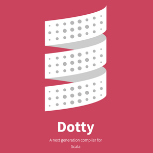

# Data Sharing and Dotty on Windows

<table style="font-family:Helvetica,Arial;font-size:14px;line-height:1.6;">
  <tr>
  <td style="border:0;padding:0 10px 0 0;max-width:80px;">
    
  </td>
  <td style="border:0;padding:0;vertical-align:text-top;">
    Introduced in <a href="https://openjdk.java.net/groups/hotspot/docs/RuntimeOverview.html#Class%20Data%20Sharing|outline">J2SE 5.0</a>, <a href="https://docs.oracle.com/javase/8/docs/technotes/guides/vm/class-data-sharing.html">Java class data sharing</a> (CDS) helps reduce the startup time for Java applications as well as reduce their memory footprint. 
    This page presents findings from our experiments with <a href="https://docs.oracle.com/javase/8/docs/technotes/guides/vm/class-data-sharing.html">CDS</a> and <a href="http://dotty.epfl.ch/">Dotty</a> on the Windows platform. 
  </td>
  </tr>
</table>

This page is part of a series of topics related to [Dotty](http://dotty.epfl.ch/) on Windows:

- [Running Dotty on Windows](README.md)
- [Building Dotty on Windows](DRONE.md)
- Data Sharing and Dotty on Windows [**&#9660;**](#bottom)
- [OpenJDK and Dotty on Windows](OPENJDK.md)

Other topics we are currently investigating include [JMH](https://openjdk.java.net/projects/code-tools/jmh/), [OpenJDK](https://adoptopenjdk.net/) and [Tasty](https://www.scala-lang.org/blog/2018/04/30/in-a-nutshell.html).

## Project dependencies

This project depends on two external software for the **Microsoft Windows** platform:

- [Oracle OpenJDK 11](https://adoptopenjdk.net/?variant=openjdk11&jvmVariant=hotspot) ([*release notes*](https://jdk.java.net/11/release-notes))
- [Dotty 0.16](https://github.com/lampepfl/dotty/releases)
- [Git 2.22](https://git-scm.com/download/win) ([*release notes*](https://raw.githubusercontent.com/git/git/master/Documentation/RelNotes/2.22.0.txt))

> **:mag_right:** [Scala 2.12](https://www.scala-lang.org/download/) is a software product announced to require Java 8. In contrast [Scala 2.13](https://www.scala-lang.org/news/roadmap-2.13.html) and [Dotty](http://dotty.epfl.ch/) (aka [Scala 3](https://www.scala-lang.org/blog/2018/04/19/scala-3.html)) are still in development and also support Java 9+. In the following we choose to work with [Oracle OpenJDK 11](https://adoptopenjdk.net/?variant=openjdk11&jvmVariant=hotspot), the 2nd [LTS](https://www.oracle.com/technetwork/java/java-se-support-roadmap.html) version after Java 8.

For instance our development environment looks as follows (*June 2019*):

<pre style="font-size:80%;">
C:\opt\jdk-11.0.3\
C:\opt\dotty-0.16.0-RC2\
C:\opt\Git-2.22.0\
</pre>

> **:mag_right:** [Git for Windows](https://git-scm.com/) provides a BASH emulation used to run [**`git`**](https://git-scm.com/docs/git) from the command line (as well as over 250 Unix commands like [**`awk`**](https://www.linux.org/docs/man1/awk.html), [**`diff`**](https://www.linux.org/docs/man1/diff.html), [**`file`**](https://www.linux.org/docs/man1/file.html), [**`grep`**](https://www.linux.org/docs/man1/grep.html), [**`more`**](https://www.linux.org/docs/man1/more.html), [**`mv`**](https://www.linux.org/docs/man1/mv.html), [**`rmdir`**](https://www.linux.org/docs/man1/rmdir.html), [**`sed`**](https://www.linux.org/docs/man1/sed.html) and [**`wc`**](https://www.linux.org/docs/man1/wc.html)).

## Directory structure

This project is organized as follows:

<pre style="font-size:80%;">
bin\sharedata.bat
cdsexamples\DottyExample,JavaExample
CDS.md
setenv.bat
</pre>

where

- file [**`bin\sharedata.bat`**](bin/sharedata.bat) creates/installs Java shared archives for the Dotty compiler/runner.
- directory [**`cdsexamples\DottyExample\`**](cdsexamples/DottyExample/) contains a tiny Scala code example demonstrating data sharing.
- directory [**`cdsexamples\JavaExample\`**](cdsexamples/JavaExample/) contains a tiny Java code example demonstrating data sharing.
- file [**`CDS.md`**](CDS.md) is the [Markdown](https://github.github.com/gfm/) document for this page.

In the next sections we present both examples and describe the usage of command [**`sharedata`**](bin/sharedata.bat).

<!--
## Batch commands

We distinguish different sets of batch commands:

1. [**`setenv.bat`**](https://github.com/michelou/dotty/tree/batch-files/setenv.bat) - This batch command makes external tools such as [**`java.exe`**](https://docs.oracle.com/javase/8/docs/technotes/tools/windows/java.html), [**`sbt.bat`**](https://www.scala-sbt.org/1.x/docs/Command-Line-Reference.html) and [**`git.exe`**](https://git-scm.com/docs/git) directly available from the command prompt.

    <pre style="font-size:80%;">
    <b>&gt; setenv help</b>
    Usage: setenv { options | subcommands }
      Options:
        -verbose         display environment settings
      Subcommands:
        help             display this help message
        update           update repository from remote master
    </pre>
-->

## Java example

Source file [**`src\main\java\Main.java`**](cdsexamples/JavaExample/src/main/java/Main.java) is the main program of our Java code example:

<pre style="font-size:80%;">
<b>package</b> cdsexamples;
<b>public class</b> Main {
    <b>public static void</b> main(String[] args) {
        System.out.println("Hello from Java !");
        <b>if</b> (args.length > 0) {
            System.out.println(VMOptions.asString());
            <i style="color:#009900;">//ScriptEngineTest.run();  // .jsa file size: 9 Mb -> 24 Mb !</i>
        }
    }
}</pre>

Batch command  [**`build`**](cdsexamples/JavaExample/build.bat) has two new options working with the **`run`** subcommand:

- Option **`-iter:<n>`** specifies the number of run iterations (for calculating meaningful average load times).
- Option **`-share`** enables/disables data sharing.

<pre style="font-size:80%;">
<b>&gt; build help</b>
Usage: build { options | subcommands }
  Options:
    -iter:1..99        set number of run iterations
    -share[:(on|off)]  enable/disable data sharing (default:off)
    -verbose           display progress messages
  Subcommands:
    clean              delete generated files
    compile            compile Java source files
    doc                generate Java documentation
    help               display this help message
    run[:arg]          execute main class with 1 optional argument
</pre>

> **:mag_right:** Internally the **`compile`** subcommand generates a Java archive and a Java shared archive as a last step of the compilation phase.

We first execute command **`build clean compile`**; the same command with option **`-verbose`** prints out the progress messages:

<pre style="font-size:80%;">
<b>&gt; build clean compile</b>
&nbsp;
<b>&gt; build -verbose clean compile</b>
Delete output directory target
Create Java archive target\JavaExample.jar
Create class list file target\JavaExample.classlist
Create Java shared archive target\JavaExample.jsa
</pre>

We can now execute our Java example ***without data sharing***; the same command with option **`-verbose`** prints out the execution report:

<pre style="font-size:80%;">
<b>&gt; build run</b>
Hello from Java !
&nbsp;
<b>&gt; build run -verbose</b>
Execute Java archive (#iterations=1) target\JavaExample.jar
Hello from Java !
Execution report:
   Share flag       : off
   Shared archive   : target\JavaExample.jsa
   Shared classes   : 0
   File classes     : 1
   jrt images       : 599
   Load time        : 0.108
   #iteration(s)    : 1
   Execution logs   : target\logs\log_share_off.log
Classes per package (600):
   java.io.* (38), java.lang.* (168), java.math.* (0), java.net.* (9)
   java.nio.* (38), java.security.* (24), java.util.* (137)
   jdk.* (111), scala.* (0), sun.* (74)
   [APP] cdsexamples.* (1)
</pre>

> **:mag_right:** Subcommand **`run`** accepts 1 optional argument for testing purposes; for instance **`build run:1`** produces the following output (see [**`src\main\java\VMOptions.java`**](cdsexamples/JavaExample/src/main/java/VMOptions.java)):
> <pre style="font-size:80%;">
> <b>&gt; build run:1</b>
> Hello from Java !
> VM Options:
>    -Xshare:off
>    -XX:SharedArchiveFile=C:\&lt;project_path&gt;\target\JavaExample.jsa
>    -Xlog:disable
> </pre>
> Value for **`-Xlog`** is different with **`build run:1 -verbose`**: 
> <pre style="font-size:80%;">
>    -Xlog:class+load:file=&lt;project_path&gt;\target\logs\log_share_on.log
> </pre>
> We have submitted a bug report related to the usage of option **`-Xlog`** on Windows (see [JDK-8215398](https://bugs.java.com/bugdatabase/view_bug.do?bug_id=JDK-8215398)); the bug was fixed on January 2, 2019.

For comparison here is the console output ***with data sharing***; option **`-verbose`** prints out the execution report:

<pre style="font-size:80%;">
<b>&gt; build run -share</b>
Hello from Java !
&nbsp;
<b>&gt; build run -verbose -share</b>
Execute Java archive (#iterations=1) target\JavaExample.jar
Hello from Java !
Execution report:
   Share flag       : on
   Shared archive   : target\JavaExample.jsa
   Shared classes   : 589
   File classes     : 0
   jrt images       : 1 (sun.nio.fs.WindowsLinkSupport source: jrt:/java.base)
   Load time        : 0.088
   #iteration(s)    : 1
   Execution logs   : target\logs\log_share_on.log
Classes per package (590):
   java.io.* (38), java.lang.* (168), java.math.* (0), java.net.* (9)
   java.nio.* (38), java.security.* (23), java.util.* (137)
   jdk.* (103), scala.* (0), sun.* (73)
   [APP] cdsexamples.* (1)
</pre>

Subcommand **`run`** with option **`-iter:<n>`** (where **`n=1..99`**) executes the Java program **`n`** times:

<pre style="font-size:80%;">
<b>&gt; build run -verbose -share -iter:4</b>
Execute Java archive (#iterations=4) target\JavaExample.jar
Hello from Java !
Hello from Java !
Hello from Java !
Hello from Java !
Execution report:
   Share flag       : on
   Shared archive   : target\JavaExample.jsa
   Shared classes   : 589
   File classes     : 0
   jrt images       : 1 (sun.nio.fs.WindowsLinkSupport source: jrt:/java.base)
   Average load time: 0.088s
   #iteration(s)    : 4
   Execution logs   : target\logs\log_share_on.log
Classes per package (590):
   java.io.* (38), java.lang.* (168), java.math.* (0), java.net.* (9)
   java.nio.* (38), java.security.* (23), java.util.* (137)
   jdk.* (103), scala.* (0), sun.* (73)
   [APP] cdsexamples.* (1)
</pre>

Let's check the contents of the output directory **`target\`**:

<pre style="font-size:80%;">
<b>&gt; tree /a /f target | findstr /v "^[A-Z]"</b>
|   JavaExample.classlist
|   JavaExample.jar
|   JavaExample.jsa
|   MANIFEST.MF
|
+---classes
|   |   .latest-build
|   |
|   \---cdsexamples
|           JavaExample.classs
|           ScriptEngineTest.class
|           VMOptions.class
|
\---logs
        log_classlist.log
        log_dump.log
        log_share_off.log
        log_share_on.log
</pre>

Note the following about the generated files:

- File **`MANIFEST.MF`** is added to **`JavaExample.jar`** as usual. 
- Files **`logs\log_classlist.log`** and **`logs\log_dump.log`** are generated when option **`-verbose`** is passed to the **`compile`** subcommand; they contain the execution logs for the generation of **`JavaExample.classlist`** resp. **`JavaExample.jsa`**.
- File **`logs\log_share_off.log`** is generated when option **`-share:off`** is passed to the **`run`** subcommand.
- File **`logs\log_share_on.log`** is generated when option **`-share:on`** is passed to the **`run`** subcommand.

For instance we can read from file **`logs\log_share_off.log`** that  source of **`cdsexamples.Main`** is **`file:/`** and that the total load time on the last line is **`0.124s`**:

<pre style="font-size:80%;">
[0.008s][info][class,load] opened: c:\opt\jdk-11.0.3\lib\modules
[0.018s][info][class,load] java.lang.Object source: jrt:/java.base
[...]
[0.121s][info][class,load] cdsexamples.Main source: file:/&lt;project_path&gt;/target/JavaExample.jar
[...]
[0.124s][info][class,load] java.lang.Shutdown$Lock source: jrt:/java.base
</pre>

We can also execute the [**`java`**](https://docs.oracle.com/en/java/javase/11/tools/java.html) command (*from Java 9+*) directly to check if data sharing is effectively used:

<pre style="font-size:80%;">
<b>&gt; java -verbose:class -Xshare:on -XX:SharedArchiveFile=target\JavaExample.jsa ^
 -jar W:\DOTTY-~1\CDSEXA~1\JAVAEX~1\target\JavaExample.jar | findstr cdsexamples</b>
[0.089s][info][class,load] cdsexamples.Main source: shared objects file

<b>&gt; java -verbose:class -Xshare:off -XX:SharedArchiveFile=target\JavaExample.jsa ^
 -jar W:\DOTTY-~1\CDSEXA~1\JAVAEX~1\target\JavaExample.jar | findstr cdsexamples</b>
[0.112s][info][class,load] cdsexamples.Main source: file:/W:/dotty-examples/cdsexamples/JavaExample/target/Main.jar
</pre>

> **:warning:** The ***crucial point*** here is to use the correct path of **`JavaExample.jar`** together with the specified Java shared archive. Command [**`grep -a`**](https://www.linux.org/docs/man1/grep.html) (**`-a`** means "*process a binary file as if it were text*") helps us to extract that path from **`JavaExample.jsa`**. 
> <pre style="font-size:80%;">
> <b>&gt; grep -aPo '.{0,40}JavaExample.jar{0,40}' target\JavaExample.jsa</b>
>   W:\DOTTY-~1\CDSEXA~1\JAVAEX~1\target\JavaExample.jar
>   W:\DOTTY-~1\CDSEXA~1\JAVAEX~1\target\JavaExample.jar
> </pre>

## Dotty example

Source file [**`src\main\scala\Main.scala`**](cdsexamples/DottyExample/src/main/scala/Main.scala) is the main program of our [Dotty](http://dotty.epfl.ch/) code example:

<pre style="font-size:80%;">
<b>package</b> cdsexamples
<b>object</b> Main {
  <b>def</b> main(args: <b style="color:#000066;">Array</b>[String]): <b style="color:#000066;">Unit</b> = {
    println("Hello from Dotty !")
    <b>if</b> (args.length > 0) {
      println(VMOptions.asString)
      <i style="color:#006600;">//TastyTest.run()</i>
    }
  }
}</pre>

Batch command [**`build`**](cdsexamples/DottyExample/build.bat) has two new options working with the **`run`** subcommand:

- Option **`-iter:<n>`** specifies the number of run iterations (for calculating meaningful average load times).
- Option **`-share`** enables/disables data sharing.

<pre style="font-size:80%;">
<b>&gt; build help</b>
Usage: build { options | subcommands }
  Options:
    -iter:1..99        set number of run iterations
    -share[:(on|off)]  enable/disable data sharing (default:off)
    -verbose           display progress messages
  Subcommands:
    clean              delete generated files
    compile            compile Scala source files
    doc                generate Scala documentation
    help               display this help message
    run[:arg]          execute main class with 1 optional argument
</pre>

> **:mag_right:** Internally the **`compile`** subcommand generates a Java archive and a Java shared archive as a last step of the compilation phase.

Similarly to the previous section we execute the following command; option **`-verbose`** prints out the progress messages:

<pre style="font-size:80%;">
<b>&gt; build clean compile</b>
&nbsp;
<b>&gt; build -verbose clean compile</b>
Delete output directory target
Create Java archive target\DottyExample.jar
Create class list file target\DottyExample.classlist
Create Java shared archive target\DottyExample.jsa
</pre>

We can now execute our [Dotty](http://dotty.epfl.ch/) example ***without data sharing*** (default settings: **`-share:off`**); option **`-verbose`** prints out the execution report:

<pre style="font-size:80%;">
<b>&gt; build run</b>
Hello from Dotty !
&nbsp;
<b>&gt; build run -verbose</b>
Execute Java archive (#iterations=1) target\DottyExample.jar
Hello from Dotty !
Execution report:
   Share flag       : off
   Shared archive   : target\DottyExample.jsa
   Shared classes   : 0
   File classes     : 265
   jrt images       : 671
   Load time        : 0.355
   #iteration(s)    : 1
   Execution logs   : target\logs\log_share_off.log
Classes per package (940):
   java.io.* (39), java.lang.* (215), java.math.* (3), java.net.* (9)
   java.nio.* (38), java.security.* (24), java.util.* (142)
   jdk.* (125), sun.* (80)
   [APP] cdsexamples.* (2)
   scala.* (28), scala.collection.* (161), scala.compat.* (0)
   scala.io.* (1), scala.math.* (19), scala.reflect.* (25)
   scala.runtime.* (5), scala.sys.* (10), scala.util.* (14)
</pre>

For comparison here is the output ***with data sharing***; option **`-verbose`** prints out the execution report:

<pre style="font-size:80%;">
<b>&gt; build run -share</b>
Hello from Dotty !
&nbsp;
<b>&gt; build run -verbose -share</b>
Execute Java archive (#iterations=1) target\DottyExample.jar
Hello from Dotty !
Execution report:
   Share flag       : on
   Shared archive   : target\DottyExample.jsa
   Shared classes   : 873
   File classes     : 0
   jrt images       : 1 (sun.nio.fs.WindowsLinkSupport source: jrt:/java.base)
   Load time        : 0.139
   #iteration(s)    : 1
   Execution logs   : target\logs\log_share_on.log
Classes per package (874):
   java.io.* (34), java.lang.* (207), java.math.* (3), java.net.* (9)
   java.nio.* (27), java.security.* (23), java.util.* (122)
   jdk.* (110), sun.* (74)
   [APP] cdsexamples.* (2)
   scala.* (28), scala.collection.* (161), scala.compat.* (0)
   scala.io.* (1), scala.math.* (19), scala.reflect.* (25)
   scala.runtime.* (5), scala.sys.* (10), scala.util.* (14)
</pre>

Subcommand **`run`** with option **`-iter:<n>`** (**`n=1..99`**) executes **`n`** times the [Dotty](http://dotty.epfl.ch/) example:

<pre style="font-size:80%;">
<b>&gt; build run -verbose -share -iter:4</b>
Execute Java archive (#iterations=4) target\DottyExample.jar
Hello from Dotty !
Hello from Dotty !
Hello from Dotty !
Hello from Dotty !
Execution report:
   Share flag       : on
   Shared archive   : target\DottyExample.jsa
   Shared classes   : 873
   File classes     : 0
   jrt images       : 1 (sun.nio.fs.WindowsLinkSupport source: jrt:/java.base)
   Average load time: 0.126s
   #iteration(s)    : 4
   Execution logs   : target\logs\log_share_on.log
Classes per package (874):
   java.io.* (34), java.lang.* (207), java.math.* (3), java.net.* (9)
   java.nio.* (27), java.security.* (23), java.util.* (122)
   jdk.* (110), sun.* (74)
   [APP] cdsexamples.* (2)
   scala.* (28), scala.collection.* (161), scala.compat.* (0)
   scala.io.* (1), scala.math.* (19), scala.reflect.* (25)
   scala.runtime.* (5), scala.sys.* (10), scala.util.* (14)
</pre>
<!--
> **:mag_right:** We can use the [**`timeit`**](bin/timeit.bat) command to display the execution times with and without data sharing for **`99`** run iterations:
>
> <pre style="font-size:80%;">
> <b>&gt; timeit build run -iter:99 | findstr /v Hello</b>
> Execution time: 00:01:22
>
> <b>&gt; timeit build run -share -iter:99 | findstr /v Hello</b>
> Execution time: 00:01:00
> </pre>
-->
Finally we can check the contents of the output directory **`target\`**:

<pre style="font-size:80%;">
<b>&gt; tree /a /f target | findstr /v "^[A-Z]"</b>
|   DottyExample.classlist
|   DottyExample.jar
|   DottyExample.jsa
|   MANIFEST.MF
|
+---classes
|   |   .latest-build
|   |
|   \---cdsexamples
|           Main$.class
|           Main.class
|           Main.tasty
|           TastyTest$.class
|           TastyTest.class
|           TastyTest.tasty
|           VMOptions$.class
|           VMOptions.class
|           VMOptions.tasty
|
\---logs
        log_classlist.log
        log_dump.log
        log_share_off.log
        log_share_on.log
</pre>

Note the following about the generated files:

- File **`MANIFEST.MF`** is added to **`DottyExample.jar`** as usual.
- Files **`classes\Main$.class`** and **`classes\Main.tasty`** (typed AST) are specific to the [Dotty](http://dotty.epfl.ch/) compiler.
- Files **`logs\log_classlist.log`** and **`logs\log_dump.log`** are generated when option **`-verbose`** is passed to the **`compile`** subcommand; they contain the execution logs for the generation of **`DottyExample.classlist`** resp. **`DottyExample.jsa`**. 
- File **`logs\log_share_off.log`** is generated when option **`-share:off`** is passed to the **`run`** subcommand.
- File **`logs\log_share_on.log`** is generated when option **`-share:on`** is passed to the **`run`** subcommand.

## Batch command `sharedata`

Command [**`sharedata`**](bin/sharedata.bat) creates and (un-)installs Java shared archives for both **`dotc`** and **`dotr`**:

<pre style="font-size:80%;">
<b>&gt; sharedata help</b>
Usage: sharedata { options | subcommands }
  Options:
    -share[:(on|off)]  set the share flag (default:off)
    -verbose           display generation progress
  Subcommands:
    activate           install the Java shared archive
    dump               create the Java shared archive
    help               display this help message
    reset              uninstall the Java shared archive
    test               execute test application (depends on dump)
</pre>

<pre style="font-size:80%;">
<b>&gt; sharedata activate</b>
Create class list file out\data-sharing\dotty-cds-compiler.classlist
Create Java shared archive out\data-sharing\dotty-cds-compiler.jsa
Create class list file out\data-sharing\dotty-cds-repl.classlist
Create Java shared archive out\data-sharing\dotty-cds-repl.jsa
Support files for Java class sharing:
   dotty-cds-compiler.classlist (119 Kb)
   dotty-cds-compiler.jsa (55616 Kb)
   dotty-cds-repl.classlist (31 Kb)
   dotty-cds-repl.jsa (16640 Kb)
   dotty-cds_0.16-0.16.0-RC2.jar (3 Kb)
</pre>

<pre style="font-size:80%;">
<b>&gt; dir /b c:\opt\dotty-0.16.0-RC2\lib\dotty-cds*</b>
dotty-cds-compiler.classlist
dotty-cds-compiler.jsa
dotty-cds-repl.classlist
dotty-cds-repl.jsa
dotty-cds_0.16-0.16.0-RC2.jar
</pre>

<pre style="font-size:80%;">
<b>package</b> cds
<b>object</b> Main {
  <b>def</b> main(args: <b style="color:#000066;">Array</b>[String]): <b style="color:#000066;">Unit</b> = {
    println("Support files for Java class sharing:")
    <b>val</b> jarUrl = getClass().getProtectionDomain().getCodeSource().getLocation()
    <b>val</b> libDir = java.nio.file.Paths.get(jarUrl.toURI()).getParent().toFile()
    <b>val</b> files = libDir.listFiles.filter(_.getName.startsWith("dotty-cds"))
    files.foreach(f => println("   "+f.getName()+" ("+(f.length()/1024)+" Kb)"))
  }
}
</pre>

Subcommand **`test`** ...*tbd*...; option **`-verbose`** prints out the execution report:
<pre style="font-size:80%;">
<b>&gt; sharedata test</b>
Support files for Java class sharing:
   dotty-cds-compiler.classlist (119 Kb)
   dotty-cds-compiler.jsa (55616 Kb)
   dotty-cds-repl.classlist (31 Kb)
   dotty-cds-repl.jsa (16640 Kb)
   dotty-cds_0.16-0.16.0-RC2.jar (3 Kb)
&nbsp;
<b>&gt; sharedata -verbose test</b>
Execute test application with Scala REPL WITHOUT Java shared archive
Support files for Java class sharing:
   dotty-cds-compiler.classlist (120 Kb)
   dotty-cds-compiler.jsa (56832 Kb)
   dotty-cds-repl.classlist (31 Kb)
   dotty-cds-repl.jsa (16640 Kb)
   dotty-cds_0.16-0.16.0-RC2.jar (4 Kb)
Execution report:
   Share flag      : off
   Shared archive  : out\data-sharing\dotty-cds-repl.jsa
   Shared classes  : 0
   File classes    : 274
   jrt images      : 680
   Load time       : 0.386s
   Execution logs  : out\data-sharing\logs\dotty-cds-repl-share.log
Classes per package (949):
   java.io.* (41), java.lang.* (218), java.net.* (9), java.nio.* (41)
   java.security.* (24), java.util.* (142), jdk.* (121), sun.* (81)
   [APP] cds.* (2)
   scala.* (28), scala.collection.* (165), scala.compat.* (0)
   scala.io.* (1), scala.math.* (19), scala.reflect.* (27)
   scala.runtime.* (6), scala.sys.* (10), scala.util.* (14)
</pre>

<pre style="font-size:80%;">
<b>&gt; sharedata -verbose -share test</b>
Execute test application with Scala REPL WITH Java shared archive
Support files for Java class sharing:
   dotty-cds-compiler.classlist (119 Kb)
   dotty-cds-compiler.jsa (55616 Kb)
   dotty-cds-repl.classlist (31 Kb)
   dotty-cds-repl.jsa (16640 Kb)
   dotty-cds_0.15-0.15.0-RC1.jar (3 Kb)
Execution report:
   Share flag      : on
   Shared archive  : out\data-sharing\dotty-cds-repl.jsa
   Shared classes  : 887
   File classes    : 0
   jrt images      : 1 (sun.nio.fs.WindowsLinkSupport source: jrt:/java.base)
   Load time       : 0.140s
   Execution logs  : out\data-sharing\logs\dotty-cds-repl-share.log
Classes per package (888):
   java.io.* (36), java.lang.* (210), java.net.* (9), java.nio.* (30)
   java.security.* (23), java.util.* (122), jdk.* (106), sun.* (75)
   [APP] cds.* (2)
   scala.* (28), scala.collection.* (165), scala.compat.* (0)
   scala.io.* (1), scala.math.* (19), scala.reflect.* (27)
   scala.runtime.* (6), scala.sys.* (10), scala.util.* (14)
</pre>

> **&#9755;** ***Data Sharing and Oracle OpenJDK 11***  
> The [Oracle OpenJDK 11](https://adoptopenjdk.net/?variant=openjdk8&jvmVariant=hotspot) installation contains the file **`<install_dir>\lib\classlist`**. Let's check if data sharing is enabled:
> 
> 1. Command **`java.exe -version`** displays the OpenJDK version amongst other information; in particular, the last displayed line ends with  **`(build 11.0.3+7, mixed mode, sharing)`** if data sharing is enabled, with **`(build 11.0.3+7, mixed mode)`** otherwise.
> 2. Command **`java.exe -Xshare:dump`** generates the 17.3 Mb Java shared archive **`<install_dir>\bin\server\classes.jsa`** from file **`<install_dir>\lib\classlist`**.
> 3. Repeat command from point 1. 
> 
> <pre style="font-size:80%;">
> <b>&gt; c:\opt\jdk-11.0.3\bin\java -version</b>
> openjdk version "11.0.3" 2019-04-18
> OpenJDK Runtime Environment AdoptOpenJDK (build 11.0.3+7)
> OpenJDK 64-Bit Server VM AdoptOpenJDK (build 11.0.3+7, mixed mode)
> &nbsp;
> <b>&gt; c:\opt\jdk-11.0.3\bin\java -Xshare:dump</b>
> [...]
> Number of classes 1272
> [...]
> mc  space:      8416 [  0.0% of total] [...]
> rw  space:   4022976 [ 22.2% of total] [...]
> ro  space:   7305216 [ 40.4% of total] [...]
> md  space:      2560 [  0.0% of total] [...]
> od  space:   6534648 [ 36.1% of total] [...]
> total    :  17873816 [100.0% of total] [...]
> &nbsp;
> <b>&gt; dir /b c:\opt\jdk-11.0.3\bin\server</b>
> classes.jsa
> jvm.dll
> &nbsp;
> <b>&gt; c:\opt\jdk-11.0.3\bin\java -version</b>
> openjdk version "11.0.3" 2019-04-18
> OpenJDK Runtime Environment AdoptOpenJDK (build 11.0.3+7)
> OpenJDK 64-Bit Server VM AdoptOpenJDK (build 11.0.3+7, mixed mode, sharing), sharing)
> </pre>
> Java 12 introduces default CDS archives ([JEP 341](http://openjdk.java.net/jeps/341))
> to improve out-of-the-box startup time and to get rid of the need to run
> **`-Xshare: dump`** to benefit from the CDS.

## Usage example

<pre style="font-size:80%;">
<b>&gt; cd examples\enum-Planet</b>
<b>&gt; dotc -share -d target\classes src\main\scala\Planet.scala "-J-Xlog:class+load=info" > class-load.txt</b>
</pre>

We can observe that 24 classes could not be found in the Java shared archive **`dotty-cds-compiler.jsa`**:

<pre style="font-size:80%;">
<b>&gt; findstr /c:"source: file" class-load.txt</b>
[0.761s][info][class,load] dotty.tools.dotc.core.Comments$Comment$ source: file:/C:/opt/dotty-0.16.0-RC2/lib/dotty-compiler_0.16-0.16.0-RC2.jar
[0.766s][info][class,load] dotty.tools.dotc.ast.untpd$Mod$ source: file:/C:/opt/dotty-0.16.0-RC2/lib/dotty-compiler_0.16-0.16.0-RC2.jar
[0.766s][info][class,load] dotty.tools.dotc.ast.untpd$Mod$Enum$ source: file:/C:/opt/dotty-0.16.0-RC2/lib/dotty-compiler_0.16-0.16.0-RC2.jar
[0.771s][info][class,load] dotty.tools.dotc.ast.untpd$Mod$Private$ source: file:/C:/opt/dotty-0.16.0-RC2/lib/dotty-compiler_0.16-0.16.0-RC2.jar
[0.772s][info][class,load] dotty.tools.dotc.ast.untpd$Mod$Final$ source: file:/C:/opt/dotty-0.16.0-RC2/lib/dotty-compiler_0.16-0.16.0-RC2.jar
[0.782s][info][class,load] dotty.tools.dotc.parsing.xml.Utility$ source: file:/C:/opt/dotty-0.16.0-RC2/lib/dotty-compiler_0.16-0.16.0-RC2.jar
[0.783s][info][class,load] dotty.tools.dotc.ast.untpd$GenFrom$ source: file:/C:/opt/dotty-0.16.0-RC2/lib/dotty-compiler_0.16-0.16.0-RC2.jar

[0.783s][info][class,load] dotty.tools.dotc.ast.untpd$ForDo$ source: file:/C:/opt/dotty-0.16.0-RC2/lib/dotty-compiler_0.16-0.16.0-RC2.jar
[0.784s][info][class,load] dotty.tools.dotc.ast.untpd$InterpolatedString$ source: file:/C:/opt/dotty-0.16.0-RC2/lib/dotty-compiler_0.16-0.16.0-RC2.jar
[0.979s][info][class,load] dotty.tools.dotc.ast.DesugarEnums$CaseKind$ source: file:/C:/opt/dotty-0.16.0-RC2/lib/dotty-compiler_0.16-0.16.0-RC2.jar
[0.988s][info][class,load] dotty.tools.dotc.typer.ProtoTypes$PolyProto$ source: file:/C:/opt/dotty-0.16.0-RC2/lib/dotty-compiler_0.16-0.16.0-RC2.jar
[1.101s][info][class,load] dotty.tools.dotc.core.Types$RecType$ source: file:/C:/opt/dotty-0.16.0-RC2/lib/dotty-compiler_0.16-0.16.0-RC2.jar
[1.349s][info][class,load] dotty.tools.dotc.ast.desugar$IdPattern$ source: file:/C:/opt/dotty-0.16.0-RC2/lib/dotty-compiler_0.16-0.16.0-RC2.jar
[1.407s][info][class,load] scala.collection.mutable.ListBuffer$$anon$1 source: file:/C:/opt/dotty-0.16.0-RC2/lib/scala-library-2.12.8.jar
[1.464s][info][class,load] dotty.tools.dotc.ast.Trees$Import$ source: file:/C:/opt/dotty-0.16.0-RC2/lib/dotty-compiler_0.16-0.16.0-RC2.jar [1.473s][info][class,load] dotty.tools.dotc.ast.Trees$Typed$ source: file:/C:/opt/dotty-0.16.0-RC2/lib/dotty-compiler_0.16-0.16.0-RC2.jar
[1.479s][info][class,load] dotty.tools.dotc.ast.Trees$SeqLiteral$ source: file:/C:/opt/dotty-0.16.0-RC2/lib/dotty-compiler_0.16-0.16.0-RC2.jar
[1.574s][info][class,load] scala.runtime.java8.JFunction1$mcZI$sp source: file:/C:/opt/dotty-0.16.0-RC2/lib/scala-library-2.12.8.jar
[1.821s][info][class,load] dotty.tools.dotc.core.NameOps$TermNameDecorator$ source: file:/C:/opt/dotty-0.16.0-RC2/lib/dotty-compiler_0.16-0.16.0-RC2.jar
[1.842s][info][class,load] dotty.tools.dotc.ast.Trees$Assign$ source: file:/C:/opt/dotty-0.16.0-RC2/lib/dotty-compiler_0.16-0.16.0-RC2.jar [1.928s][info][class,load] dotty.tools.backend.jvm.BCodeAsmCommon$EnclosingMethodEntry source: file:/C:/opt/dotty-0.16.0-RC2/lib/dotty-compiler_0.16-0.16.0-RC2.jar
[2.075s][info][class,load] scala.transient source: file:/C:/opt/dotty-0.16.0-RC2/lib/scala-library-2.12.8.jar
[2.076s][info][class,load] scala.volatile source: file:/C:/opt/dotty-0.16.0-RC2/lib/scala-library-2.12.8.jar
</pre>

## Related reading

### 2006
<dl>
  <dt><a href="https://www.ibm.com/developerworks/java/library/j-ibmjava4/index.html">IBM Developer</a>:<a name="ref_01">&nbsp;</a>Class sharing</dt>
  <dd><i>by Ben Corrie (2006-05-30)</i> The IBM implementation of the 5.0 JVM allows all system and application classes to be stored in a persistent dynamic class cache in shared memory.</dd>
</dl>

### 2014
<dl>
<!--
  <dt><a href="https://patents.google.com/patent/US9336018"><b>US9336018</b></a>: <a name="ref_02">&nbsp;</a>Mechanism for class data sharing using extension and application class-loaders (2014-05-02)</dt>
  <dd> </dd>
-->
  <dt><a href="http://openjdk.java.net/jeps/250"><b>JEP 250</b></a>:<a name="ref_03">&nbsp;</a>Store Interned Strings in CDS Archives</dt>
  <dd><i>by Jiangli Zhou (2014-09-24)</i> Interned strings are now stored in CDS archives.</dd>
</dl>

### 2017
<dl>
  <dt><a href="https://openjdk.java.net/jeps/310"><b>JEP 310</b></a>:<a name="ref_04">&nbsp;</a>Application Class-Data Sharing</dt>
  <dd><i>by Ioi Lam (2017-08-08)</i> To improve startup and footprint, AppCDS extends the existing CDS feature to allow application classes to be placed in the shared archive.</dd>
</dl>

### 2018
<dl>
  <dt><a href="https://bugs.openjdk.java.net/browse/JDK-8198565"><b>JDK-8198565</b></a>:<a name="ref_05">&nbsp;</a>Extend CDS to Support the Module Path</dt>
  <dd><i>by Calvin Cheung (2018-02-22)</i> In JDK 11, CDS has been improved to support archiving classes from the module path.</dd>

  <dt><a href="https://openjdk.java.net/jeps/341"><b>JEP 341</b></a>:<a name="ref_06">&nbsp;</a>Default CDS Archives</dt>
  <dd><i>by Jiangli Zhou, Calvin Cheung, Ioi Lam (2018-06-01)</i> The JDK build process now generates a CDS archive, using the default class list, on 64-bit platforms.</dd>

  <dt><a href="https://www.youtube.com/watch?v=b8GzWd--RXg"> JEEConf 2018</a>:<a name="ref07">&nbsp;</a>Class Data Sharing in the HotSpot VM</dt>
  <dd><i>by <a href="https://jeeconf.com/speaker/volker-simonis-2/">Volker Simonis</a> (2018-06-05)</i> In his talk Volker Simonis introduces CDS and AppCDS and demonstrates how it can be used (<a href="https://simonis.github.io/JEEConf2018/CDS/cds.xhtml#/">web slides</a>).</dd>

  <dt><a href="https://developer.ibm.com/tutorials/j-class-sharing-openj9/"><b>IBM Developer</b></a>:<a name="ref_08">&nbsp;</a>Class sharing in Eclipse OpenJ9</dt>
  <dd><i>by Ben Corrie and Hang Shao (2018-06-06)</i> In the <a href="https://www.eclipse.org/openj9/">OpenJ9</a> implementation, all systems, application classes and ahead-of-time (<a href="https://www.eclipse.org/openj9/docs/aot/">AOT</a>) compiled code can be stored in a dynamic class cache in shared memory.</dd>

  <dt><a href="https://www.youtube.com/watch?v=nniYSR4GAH4"> Oracle Code 2018</a>:<a name="ref09">&nbsp;</a>Application Class Data Sharing</dt>
  <dd><i>by Ioi Lam and Jiangli Zhou (2018-10-23)</i> Archiving and Sharing Class Metadata and Java Objects in HotSpot VM to Improve Startup Performance and Reduce Footprint (<a href="docs/20181023_Application_Class_Data_Sharing.pdf" title="">PDF</a>).</dd>
</dl>

### 2019
<dl>
  <dt><a href="https://advancedweb.hu/2019/02/19/post_java_8/"><b>From Java 8 to 11 and beyond</b></a>:<a name="ref_05">&nbsp;</a>A categorized list of all Java and JVM features since JDK 8</dt>
  <dd><i>by Dávid Csákvári (2019-04-19)</i> JDK 8 was released in 2014. But since then things accelerated and many features came out with JDK10, JDK11 and beyond.</dd>
</dl>

<!--
## Footnotes

<a name="footnote_01">[1]</a> ***2018-08-17*** [↩](#anchor_01)

-->
***

*[mics](http://lampwww.epfl.ch/~michelou/)/June 2019* [**&#9650;**](#top)
&nbsp;
